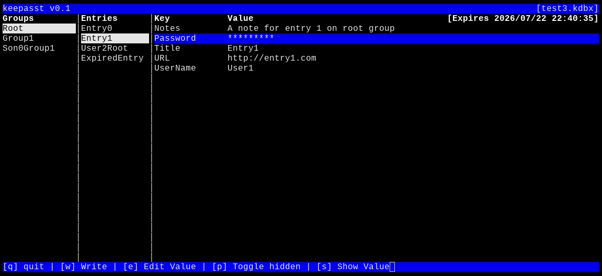

# keepasst

A terminal-based (TUI) password manager for KeePass2 databases, built with ncurses.

`keepasst` lets you open, browse, and manage your KeePass2 (`.kdbx`) files directly
from the terminal — no GUI, no browser, just fast keyboard-driven access to your
credentials.

## Features

- TUI interface powered by ncurses
- Read and write KeePass2 (`.kdbx`) databases
- Copy passwords and usernames to the clipboard
- Keyboard-driven navigation
- Native support for modern KDBX key derivation (Argon2)

## Dependencies

`keepasst` requires the following libraries:

- [libargon2](https://github.com/P-H-C/phc-winner-argon2)
- [libxml2](https://gitlab.gnome.org/GNOME/libxml2)
- [zlib](https://zlib.net/) — compression
- [OpenSSL](https://www.openssl.org/)
- [ncurses](https://invisible-island.net/ncurses/)

### Installing dependencies

**Debian / Ubuntu**

```sh
apt-get install libargon2-dev libxml2-dev zlib1g-dev libssl-dev libncurses-dev
```

**Arch Linux**

```sh
pacman -S argon2 libxml2 zlib openssl ncurses
```

**macOS (Homebrew)**

```sh
brew install argon2 libxml2 zlib openssl ncurses
```

**FreeBSD**

```sh
pkg install argon2 libxml2 zlib openssl ncurses
```

**OpenBSD**

```sh
pkg_add argon2 libxml2 zlib openssl ncurses
```

## Building

```sh
make
make install
```

## Usage

```sh
keepasst path/to/database.kdbx
```

If the database file does not exist, a new one will be created.

See the manpage for details:
```sh
man keepasst
```

You will be prompted for your master password. Once unlocked, use the on-screen
key bindings to navigate, search, and edit entries.

## Screenshot

